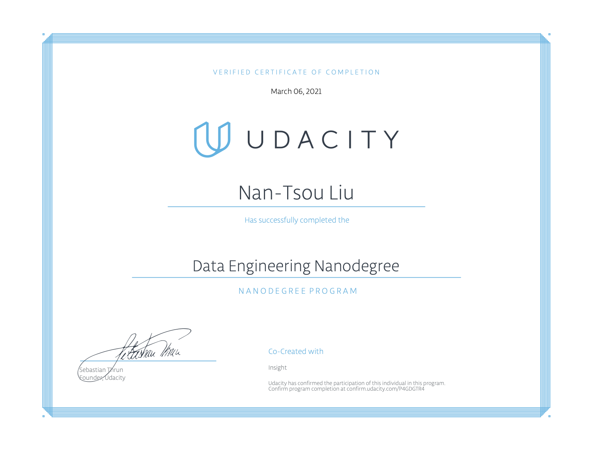

# Udacity Data Engineer Nanodegree

## Completed Projects

1. Data Modeling: Model data with Postgresql and Apache Cassandra.
2. Cloud Data Warehouses: Use AWS Redshift to build a data pipeline of data warehouse.
3. Data Lake with Spark: Use Apache Spark to build a data pipeline of data lake.
4. Data Pipeline wiht Airflow: Use Apache Airflow to build a scheduler of a data pipeline.
5. Capstone Project: Use data provided by Udacity to build an ETL data pipeline wiht the technologies learned in this Nanodegree.
