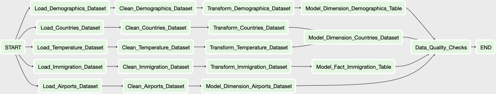

# Data Engineer Capstone Project

## Introduction

The goal of this project is to build an ETL pipeline with data provided by Udacity.
Apache Spark is mainly used in this project to build the methods for **loading**, **cleaning**, **transforming**, **modeling** and **quality checking** purposes.
**Star Schema** is used for the data model, one fact table, immigration, and 3 dimension tables, demographics, airports and countries.

The built data pipeline looks like below

## Datasets

1. I94 Immigration Data: This data comes from the US National Tourism and Trade Office. [link](https://travel.trade.gov/research/reports/i94/historical/2016.html) **Only the i94_apr16_sub.sas7bdat will be used in this project.**
2. World Temperature Data: This dataset came from Kaggle. You can read more about it. [link](https://www.kaggle.com/berkeleyearth/climate-change-earth-surface-temperature-data)
3. U.S. City Demographic Data: This data comes from OpenSoft. You can read more about it. [link](https://public.opendatasoft.com/explore/dataset/us-cities-demographics/export/)
4. Airport Code Table: This is a simple table of airport codes and corresponding cities from data hub. [link](https://datahub.io/core/airport-codes#data)
5. Countries: This dataset is extracted from `I94_SAS_Labels_Descriptions.SAS` provided by Udacity.

## Files

* **capstone_project.ipynb**: The main jupyter notebook file of this project.
* **capstone-dag.png**: The dag figure describe the relationship of each operator in the data pipeline.
* **utils/common.py**: The common methods used in the project.
* **utils/cleaning.py**: The data cleaning methods used in the project.
* **utils/loading.py**: The data loading methods used in the project.
* **utils/modeling.py**: The data modeling methods used in the project.
* **utils/quality_checking.py**: The data quality checking methods used in the project.
* **utils/transforming.py**: The data transforming methods used in the project.
* **data/sas_data**: The folder contains converted data in parquet file of immigration in Apr 2016.
* **data/airport-codes_csv.csv**: The airports data in csv file.
* **data/countries.csv**: The countries data in csv file which is extracted from I94_SAS_Labels_Descriptions.SAS
* **data/us-cities-demographics.json**: The demographics data in json file.