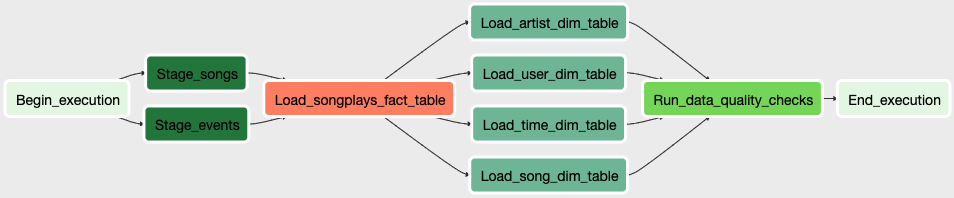

# Data Pipeline

## Introduction

This project is to help a music streaming startup, Sparkify, to move their processes and data onto cloud.
An ETL pipeline is built to extract their data from S3, stage them in Redshift, and transform them into a set of analytics tables.
Airflow is used to make the ETL pipeline more automation and monitoring.

## Datasets

The source datasets are **song dataset** and **log dataset**. Both of them are in json format.

## Data Schema

### Staging tables

* **staging_events**: Actions done by the users.
* **staging_songs**: Songs and artists information.

### Fact tables

* **fact_songplay**: Records in event data associated with song plays.

### Dimension tables

* **dim_users**: Users in the app.
* **dim_songs**: Songs in music database.
* **dim_artist**: Artists in music database.
* **dim_time**: Timestamps of records in songplays broken down into specific units.

## Configuration DAG

Following the suggestion of Udacity, the default parameters of the dag as follows:

1. The DAG has no dependencies on past runs.
2. On failure, the task will be retried 3 times.
3. The interval of each retry is 5 minutes.
4. Catchup is disabled.
5. No notification on retry.

The final operator relationship is shown below.

## Files

* **airflow/create_tables.sql**: The queries of creating necessary tables for ETL, which is provided by Udacity.
* **airflow/dags/sparkify_data_pipeline.py**: The dag file of sparkify data pipeline.
* **airflow/plugins/helpers/sql_queries.py**: ETL queries provided by Udacity.
* **airflow/plugins/operators/data_quality.py**: Data quality operator, which is used to check the data quality after ETL finished.
* **airflow/plugins/operators/load_dimension.py**: Dimension operator, which is used to transform data and insert data into dimension table.
* **airflow/plugins/operators/load_fact.py**: Fact operator, which is used to transform data and insert data into fact table.
* **airflow/plugins/operators/stage_redshift.py**: Stage operator, which is used to load data from S3 into staging table in Redshift.

## Quick Start

1. Create IAM and Redshift cluster on aws console.
2. Execute the table creating queries in `airflow/create_tables.sql` on in Redshift.
3. Launch airflow web server, scheduler and workers.
4. Setup connections on airflow for aws credentials and redshift.
5. Unpause dag with `sparkify_data_pipeline` as dag id in this case.
6. Check the job status on airflow UI.